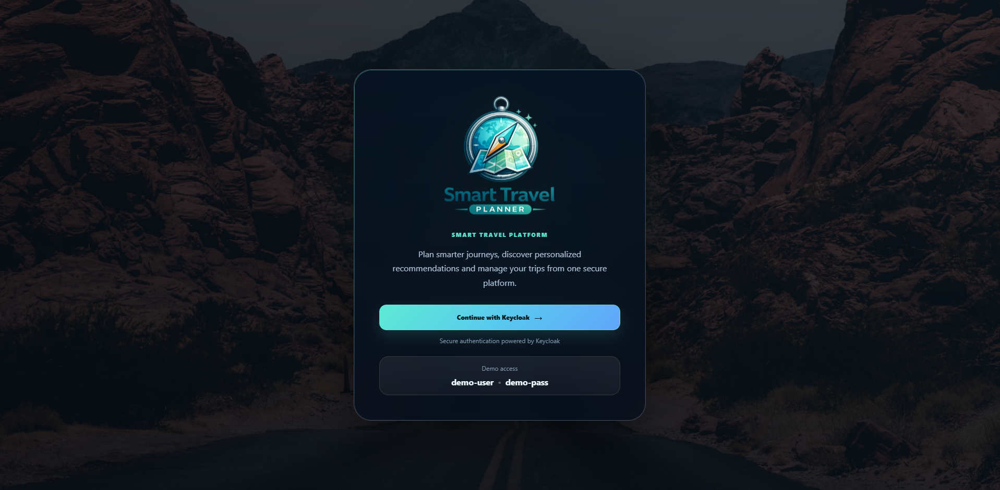
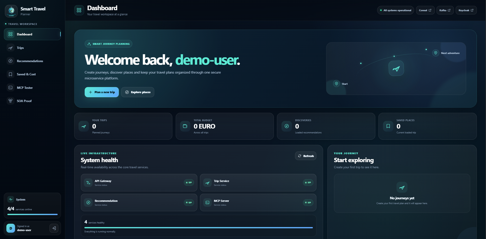
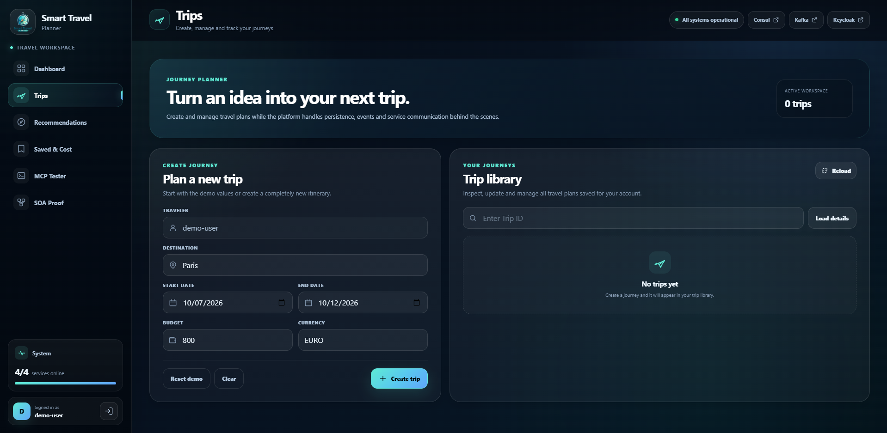
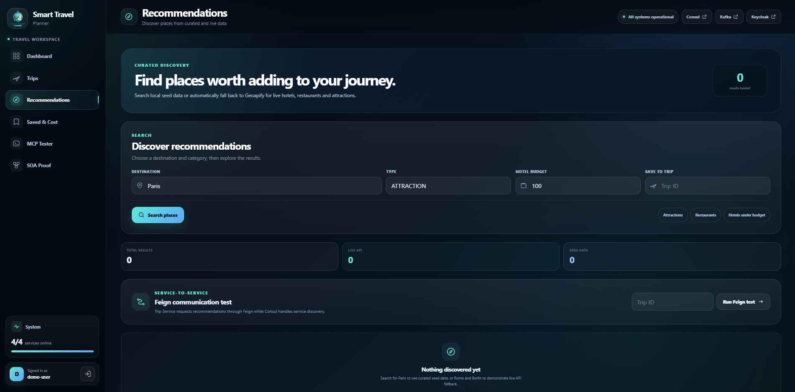
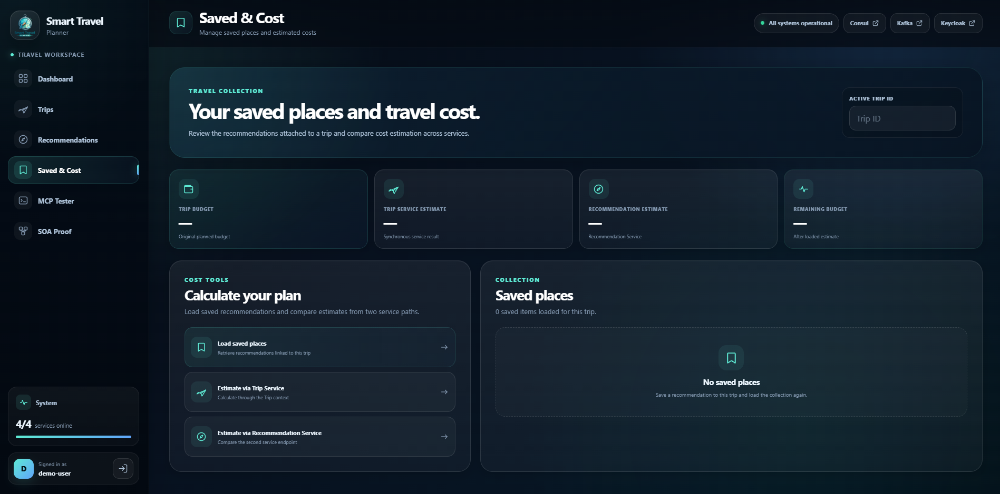
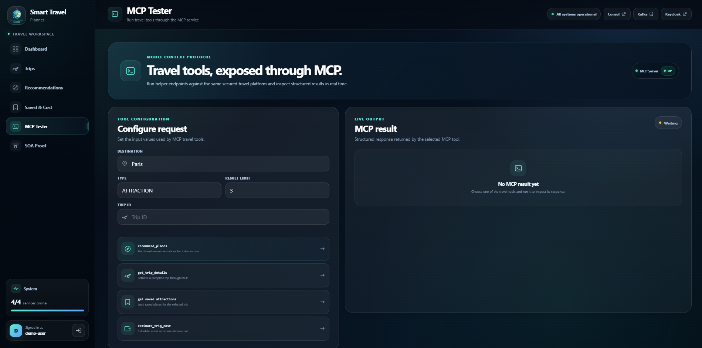
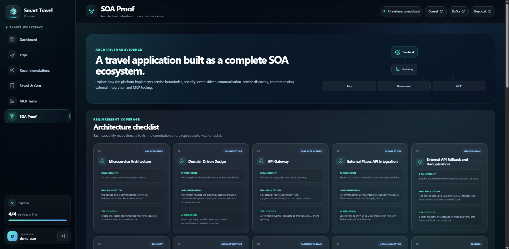

# Smart Travel Planner


Smart Travel Planner is a **Dockerized microservice-based travel planning platform** built with Spring Boot and React.

It demonstrates modern **Service-Oriented Architecture (SOA)** concepts including API Gateway routing, service discovery, authentication, synchronous and asynchronous service communication, external API integration, contract testing, and MCP tooling.

---

## Authors

- Nikola Sarafimov
- Klaudija Stamenova

---

## Overview

The application allows users to:

- Create and manage trips
- Search attractions, hotels, and restaurants
- Save recommendations to specific trips
- Estimate the total cost of saved recommendations
- Retrieve live travel data through the **Geoapify Places API**
- Authenticate securely using **Keycloak**
- Test synchronous communication through **OpenFeign**
- Demonstrate event-driven communication through **Kafka**
- Test MCP-based travel tools
- Run the complete system through **Docker Compose**

---

## UI Preview

### Login



### Dashboard



### Trips



### Recommendations



### Saved & Cost



### MCP Tester



### SOA Proof



---

## Architecture

### Core Request Flow

```text
React Frontend
      |
      v
 API Gateway
      |
  +---+-------------+---+
  |                 |   |
  v                 v   v
Trip Service      Rec.  MCP Server
                  Service
  |                 |
  v                 v
Trip DB          Rec. DB
```

### Service Communication

```text
Trip Service
     |
     +-- Feign --> Recommendation Service
     |
     +-- Kafka --> trip-created
                       |
                       v
              Recommendation Service
```

### Supporting Infrastructure

```text
Keycloak -> Authentication
Consul   -> Service Discovery
Kafka    -> Event Communication
```

The system is divided into independent services with separate responsibilities and separate databases.

---

## Technology Stack

### Backend

- Java 21
- Spring Boot
- Spring Cloud
- Spring Security
- Spring Cloud Gateway
- OpenFeign
- Spring Kafka
- Spring Data JPA
- PostgreSQL
- Keycloak
- Consul
- Pact
- Spring AI MCP Server
- Swagger / OpenAPI

### Frontend

- React
- Vite
- Axios
- Keycloak JS
- Nginx

### Infrastructure

- Docker
- Docker Compose
- Apache Kafka
- Kafka UI
- PostgreSQL
- Consul
- Keycloak

---

## Microservices

### Trip Service

Responsible for trip management.

Main capabilities:

- Create, update, delete, and retrieve trips
- Retrieve trips by user
- Publish `trip-created` Kafka events
- Communicate with Recommendation Service through Feign
- Retrieve recommendations and estimated trip costs

```http
POST   /api/trips
GET    /api/trips
GET    /api/trips/{id}
PUT    /api/trips/{id}
DELETE /api/trips/{id}

GET /api/trips/{id}/recommendations
GET /api/trips/{id}/estimated-cost
```

### Recommendation Service

Responsible for travel recommendations and saved places.

Main capabilities:

- Search attractions, hotels, and restaurants
- Return local seed data
- Retrieve live recommendations from Geoapify
- Save recommendations to trips
- Estimate total recommendation costs
- Consume `trip-created` Kafka events
- Prevent duplicate external records using `externalPlaceId`

```http
GET /api/recommendations
GET /api/recommendations/hotels

GET /api/recommendations/restaurants
GET /api/recommendations/attractions

POST /api/recommendations/{id}/save

GET /api/recommendations/saved
GET /api/recommendations/estimate
```

### API Gateway

Provides a single entry point for backend communication.

```text
/api/trips/**
    -> Trip Service

/api/recommendations/**
    -> Recommendation Service

/mcp
/mcp/**
    -> MCP Server
```

The API Gateway also validates **Keycloak JWT tokens** and uses **Consul service discovery**.

### MCP Server

Exposes Smart Travel Planner functionality through MCP tools.

Available tools:

```text
recommend_places
get_trip_details
get_saved_attractions
estimate_trip_cost
```

The MCP Server authenticates using the OAuth2 **client credentials flow** and communicates with backend services through the API Gateway.

---

## SOA Concepts

| Concept | Implementation |
|---|---|
| Microservices | Independent Trip and Recommendation services |
| Domain-Driven Design | Separate Trip and Recommendation bounded contexts |
| API Gateway | Spring Cloud Gateway |
| Service Discovery | Consul |
| Authentication | Keycloak + JWT |
| Synchronous Communication | OpenFeign |
| Asynchronous Communication | Kafka |
| External API Integration | Geoapify Places API |
| Contract Testing | Pact |
| MCP Integration | Spring AI MCP Server |
| Persistence | Separate PostgreSQL databases |
| Containerization | Docker Compose |

---

## External API Integration

The Recommendation Service integrates with the **Geoapify Places API**.

Recommendation strategy:

```text
1. Search local seed data
2. Return seed data when available
3. Otherwise request live data
4. Persist external recommendations
5. Deduplicate by externalPlaceId
```

This provides predictable local data for testing while still supporting live travel recommendations.

---

## Security

Authentication and authorization are handled by **Keycloak**.

```text
User
 |
 v
Keycloak
 |
 v
JWT Access Token
 |
 v
React Frontend
 |
 v
API Gateway
 |
 v
Backend Services
```

Protected API endpoints require a valid JWT.

The MCP Server uses a dedicated confidential Keycloak client and obtains its own service token through the OAuth2 client credentials flow.

---

## Service Discovery

Backend services register with **Consul** for service discovery and health monitoring.

The main registered services are:

- API Gateway
- Trip Service
- Recommendation Service
- MCP Server

Consul UI is available locally at:

```text
http://localhost:8500
```

---

## Synchronous Communication

Synchronous service-to-service communication is implemented using **OpenFeign**.

```text
Frontend
   |
   v
API Gateway
   |
   v
Trip Service
   |
   v
Feign Client
   |
   v
Recommendation Service
```

This allows Trip Service to retrieve recommendation data from Recommendation Service without exposing service-location details to the client.

---

## Asynchronous Communication

Asynchronous communication is implemented using **Apache Kafka**.

```text
Trip Service
    |
    v
trip-created event
    |
    v
Kafka
    |
    v
Recommendation Service
```

When a new trip is created, Trip Service publishes a `trip-created` event that can be consumed independently by Recommendation Service.

Kafka UI is available locally at:

```text
http://localhost:8085
```

---

## Contract Testing

The project uses **Pact** for consumer-driven contract testing.

```text
Consumer:
Trip Service

Provider:
Recommendation Service
```

### Consumer Test

```bash
./mvnw -f trip-service/pom.xml \
  -Dtest=TripRecommendationConsumerPactTest \
  test
```

### Provider Verification

```bash
./mvnw \
  -f recommendation-service/pom.xml \
  -Dtest=RecommendationProviderPactVerificationTest \
  test
```

---

## Running the Project

### Requirements

- Docker Desktop
- Git

Java 21 and Node.js are only required when running services outside Docker.

### Clone the Repository

```bash
git clone \
  https://github.com/nikolasarafimov/smart-travel-planner.git

cd smart-travel-planner
```

### Environment Variables

Create a `.env` file in the project root.

You can use `.env.example` as a template.

```env
MCP_CLIENT_SECRET=YOUR_SECRET
GEOAPIFY_API_KEY=YOUR_API_KEY
```

`MCP_CLIENT_SECRET` is required for the MCP confidential Keycloak client.

`GEOAPIFY_API_KEY` enables live Geoapify recommendations. Without it, live external API functionality is unavailable.

> Never commit `.env` files, passwords, API keys, or other secrets to GitHub.

### Start the Application

```bash
docker compose up -d --build
```

### Check Running Containers

```bash
docker compose ps
```

### Open the Frontend

```text
http://localhost:3000
```

### Stop the Application

```bash
docker compose down
```

To also remove persistent Docker volumes:

```bash
docker compose down -v
```

---

## Demo Credentials

A demo Keycloak user is included for local development and demonstration.

```text
Username: demo-user
Password: demo-pass
```

These credentials are intended for **local development only**.

---

## Service URLs

| Component | Local URL |
|---|---|
| Frontend | `http://localhost:3000` |
| API Gateway | `http://localhost:8080` |
| Trip Service | `http://localhost:8081` |
| Recommendation Service | `http://localhost:8082` |
| Kafka UI | `http://localhost:8085` |
| Keycloak | `http://localhost:8086` |
| MCP Server | `http://localhost:8087` |
| Consul UI | `http://localhost:8500` |

---

## Frontend

The React frontend provides a user-facing interface for demonstrating the complete platform.

### Dashboard

Provides:

- Live service health
- Trip overview
- Budget overview
- Recommendation statistics
- Saved-place statistics
- External API integration status
- Infrastructure shortcuts

### Trips

Allows users to:

- Create trips
- Retrieve trip details
- Update trip status
- Delete trips
- Inspect trip data

### Recommendations

Allows users to:

- Search recommendations by destination
- Search attractions, hotels, and restaurants
- Demonstrate seed-data results
- Demonstrate Geoapify live fallback
- Save recommendations to trips
- Test Feign communication

### Saved & Cost

Allows users to:

- Retrieve saved recommendations
- Estimate costs through Trip Service
- Estimate costs through Recommendation Service
- Compare cost results

### MCP Tester

Allows users to execute:

```text
recommend_places
get_trip_details
get_saved_attractions
estimate_trip_cost
```

and inspect structured MCP responses.

### SOA Proof

Provides a visual architecture checklist covering:

- Microservice architecture
- Domain-Driven Design
- API Gateway
- Service discovery
- Keycloak security
- Feign communication
- Kafka communication
- External API integration
- Fallback and deduplication
- Pact contract testing
- MCP integration
- Dockerization

---

## Testing

The project includes automated and manual testing for:

- Frontend builds
- Backend Maven builds
- Docker image builds
- Keycloak authentication
- Protected API endpoints
- Unauthorized request rejection
- Trip CRUD operations
- Seed recommendations
- Live recommendations
- Geoapify fallback
- Kafka event communication
- Feign communication
- Recommendation saving
- Cost estimation
- MCP tools
- Pact consumer/provider contracts
- Full-stack end-to-end behavior

---

## GitHub Actions

The repository contains automated **CI** and **E2E** workflows.

### CI

The CI workflow validates:

- API Gateway build
- Trip Service build
- Recommendation Service build
- MCP Server build
- Frontend build
- Docker Compose configuration
- Docker image builds

```text
.github/workflows/ci.yml
```

### E2E

The E2E workflow starts the complete Dockerized stack and verifies the main application flow.

It covers:

- Full-stack startup
- Keycloak authentication
- Unauthorized access rejection
- Recommendation retrieval
- Trip creation
- Trip retrieval
- Feign communication
- Recommendation saving
- Cost estimation
- MCP functionality
- Environment cleanup

```text
.github/workflows/e2e.yml
```

The workflow badges at the top of this README show the current status of both pipelines.

---

## Manual API Testing

Manual Docker-based API requests are available in:

```text
docs/docker-tests.http
```

These requests can be used to verify the complete application flow locally.

---

## Project Highlights

- Microservice architecture with isolated bounded contexts
- Secure JWT authentication with Keycloak
- Centralized routing through API Gateway
- Service discovery through Consul
- Kafka-based event-driven communication
- Feign-based synchronous communication
- Live travel data from Geoapify
- Seed-data-first recommendation strategy
- External recommendation deduplication
- Consumer-driven contract testing with Pact
- MCP Server integration
- Separate PostgreSQL databases
- Fully containerized Docker Compose environment
- Modern React frontend
- Automated CI workflow
- Automated full-stack E2E workflow
- Reproducible Keycloak realm configuration

---

## Project Structure

```text
smart-travel-planner/
|
+-- .github/
|   +-- workflows/
|
+-- api-gateway/
+-- trip-service/
+-- recommendation-service/
+-- mcp-server/
+-- frontend/
+-- keycloak/
+-- docs/
|
+-- .env.example
+-- .gitignore
+-- docker-compose.yml
+-- README.md
```

---

## Development Flow

A typical local demonstration flow is:

```text
1. Configure .env
2. Start Docker Compose
3. Login through Keycloak
4. Create a trip
5. Search recommendations
6. Save a recommendation
7. Test Feign communication
8. Inspect Kafka events
9. Estimate trip cost
10. Run MCP tools
11. Inspect services in Consul
12. Run Pact tests
```

---

## Notes

Smart Travel Planner is designed as a practical demonstration of modern **Service-Oriented Architecture** principles.

The project combines:

- distributed application development
- microservices
- authentication and authorization
- service discovery
- synchronous communication
- asynchronous communication
- external API integration
- persistence
- contract testing
- containerization
- CI
- end-to-end testing
- MCP tooling
- frontend UX

into one reproducible platform.